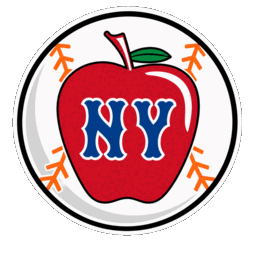

<p align="center">
  
</p>

<h1 align="center">Mets Home Run Apple</h1>

<p align="center"><strong>Build and test a physical Wi-Fi Home Run Apple with Apple Lab, or follow Mets games live with the Virtual Apple.</strong></p>

<p align="center">
  <a href="https://nodejs.org/"></a>
  
</p>


This is a fan project inspired by the Home Run Apple at Citi Field. The build is designed to follow Mets games, show the score, and raise the Apple for confirmed home runs and wins.

The repository also includes two browser apps:

- **Apple Lab** is the local manager, simulator, and replay tool used for physical Apple.
- **Virtual Apple** is a [public gameday experience](https://virtual-mets-apple.pages.dev/) with a 3D center-field scene, live scoreboards, radio, celebrations, and desktop Focus and Mini views. See the [Virtual Apple guide](apps/virtual-apple/README.md).

<p align="center"><a href="https://virtual-mets-apple.pages.dev/"><strong>Live Virtual Mets Apple</strong></a></p>

## Project status

Working today:

- the shared C++ core, native tests, and WebAssembly build;
- live schedule/feed reading and completed-game replay;
- review, delay, doubleheader, win, duplicate-event, and between-game handling;
- Apple Lab's simulator, diagnostics, CSV exports, and 3D preview;
- Virtual Apple's live presentation, Focus and Mini views, local demo mode, audio, rain, and accessibility features.

Still to build:

- repeatable Nano setup with per-device identity, Wi-Fi provisioning, storage, display, and motor adapters;
- authenticated local device management, ownership transfer, and a safe signed update path;
- optional owner claiming and remote telemetry for Apples installed in other homes;
- an approved parts list and a physical assembly, calibration, and acceptance process;
- measured, printable Apple and base files that eliminate the need for a giveaway donor;
- reference measurements and initial physical calibration after the giveaway Apple arrives;
- a complete donor-free validation build using the printable Apple and base;
- unloaded and guarded actuator tests before the Apple is attached.

The browser apps cannot command physical hardware. The Nano will remain in charge once the hardware layer is added.

See [Physical build guide](docs/PHYSICAL_BUILD.md) for the parts, assembly, calibration, and acceptance workflow, and [3D-printed Apple and base](docs/3D_PRINTING.md) for the replacement-part process.

## Quick start

You need Node.js 22.13 or newer and pnpm 10.

```bash
pnpm install
pnpm dev:lab
```

Run Virtual Apple:

```bash
pnpm dev:virtual
```

- Apple Lab: `http://localhost:4173`
- Virtual Apple: `http://localhost:4174`
- Virtual Apple demo controls: `http://localhost:4174/?demo=1`

## Architecture

One C++ core owns event decisions and sequence safety. Scoreboards read game data directly; the core receives a smaller decision input and returns celebration events and motion commands. It runs in native tests, in both browser apps through WebAssembly, and eventually on the Nano ESP32.

[Architecture guide](docs/ARCHITECTURE.md).

## Test and build

```bash
pnpm lint
pnpm typecheck
pnpm test
pnpm build
```

The full test command also needs CMake, a C++17 compiler, and Emscripten. Generated WebAssembly is checked in, so normal browser development does not require rebuilding it by hand.

## Repository structure

| Path | What lives there |
|---|---|
| `apps/apple-lab/` | Local manager, simulator, and historical replay |
| `apps/virtual-apple/` | Public game-day website |
| `firmware/` | Shared C++ core, native tests, and future ESP32 adapters |
| `hardware/` | Physical parts list and per-unit build record |
| `packages/apple-3d/` | Apple model, scene, textures, and actuator animation |
| `packages/game-core-wasm/` | Browser wrapper around the C++ core |
| `packages/mlb-live-feed/` | Schedule, live-feed, and archive handling |
| `packages/protocol/` | Game, core, display, event, and motion contracts |
| `packages/scoreboard-ui/` | Reusable accessible scoreboard |
| `packages/test-fixtures/` | Offline game scenarios |


## Inspiration and credit

Special thanks to Reddit user [u/jboogie1844](https://www.reddit.com/user/jboogie1844/) for sharing his WiFi Home Run Apple in [this r/NewYorkMets post](https://www.reddit.com/r/NewYorkMets/comments/1v96vfz/1_year_later_and_my_wifi_home_run_apple_has/).
