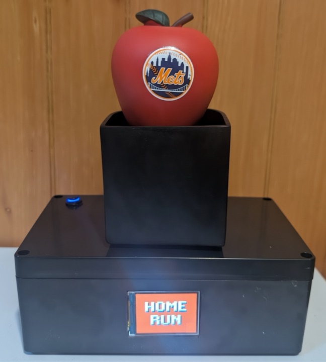
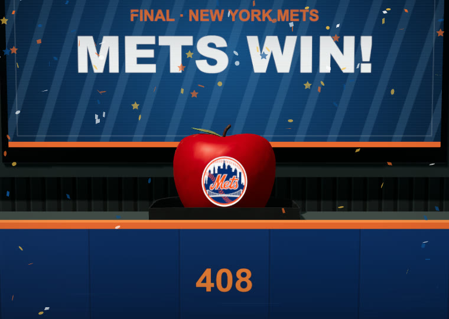
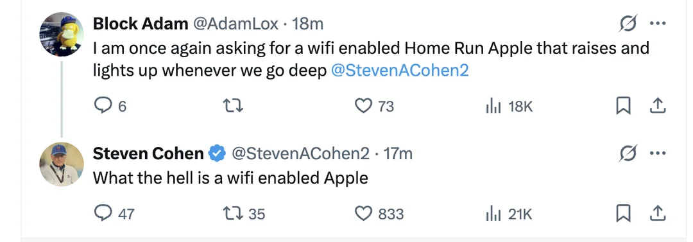

<p align="center">
  
</p>

<h1 align="center">Mets Home Run Apple</h1>

<p align="center"><strong>A Wi-Fi Home Run Apple, a builder's lab, and a live virtual gameday site.</strong></p>

<p align="center">
  <a href="https://nodejs.org/"></a>
  
</p>

This fan project is inspired by the Home Run Apple at Citi Field. The physical
build follows Mets games live, shows the score, and raises for confirmed Mets home
runs and wins. Once it has Wi-Fi, it runs on its own without a computer or browser.

<table align="center">
  <tr>
    <td align="center" valign="top">
      <br />
      <sub><strong>Physical Apple build</strong> </sub>
    </td>
    <td align="center" valign="top">
      <br />
      <sub><strong>Virtual Apple</strong> · <a href="https://metsapple.com/">metsapple.com</a></sub>
    </td>
  </tr>
</table>

| | |
| --- | --- |
| [Physical Apple](firmware/README.md) | Autonomous Nano ESP32 firmware, display, and lift control |
| [Apple Manager](https://metsapple.com/setup/) | Setup and settings page served by the physical Apple |
| [Apple Lab](apps/apple-lab/README.md) | Local simulator, replay tool, diagnostics, and hardware tests |
| [Virtual Apple](apps/virtual-apple/README.md) | [Public gameday site](https://metsapple.com/) with a 3D field, scoreboards, radio, and celebrations |

## Run the browser apps

You need Node.js 22.13 or newer and pnpm 10.

```bash
pnpm install
pnpm dev:lab
```

Apple Lab opens at <http://localhost:4173>.

Run Virtual Apple separately:

```bash
pnpm dev:virtual
```

Virtual Apple opens at <http://localhost:4174>. Add `?demo=1` to use the local
demo controls.

## Check 

```bash
pnpm lint
pnpm typecheck
pnpm test
pnpm build
```

The full test suite also needs CMake, a C++17 compiler, and Emscripten. Browser
development uses the committed WebAssembly builds, so you do not need to
rebuild them for every change.

## Project Structure

| Path | Contents |
| --- | --- |
| `apps/` | Apple Lab and Virtual Apple |
| `edge/` | Virtual Apple notification worker |
| `firmware/` | Shared C++, Nano firmware, native tests, and Apple Manager |
| `packages/` | Browser libraries, UI, 3D scene, protocol, and test fixtures |
| `docs/ARCHITECTURE.md` | [System map and code boundaries](docs/ARCHITECTURE.md) |
| `docs/WIRING.md` | [Wiring diagram](docs/WIRING.md) for the physical build |
| `docs/PARTS.md` | [Parts list](docs/PARTS.md) for the physical build |

## Inspiration

In March 2025, a tweet about a Wi-Fi enabled Home Run Apple.
[r/NewYorkMets discussion](https://www.reddit.com/r/NewYorkMets/comments/1jixetv/are_we_pro_or_anti_wifi_enabled_apple_for_2025/).

<p align="center">
  <a href="https://www.reddit.com/r/NewYorkMets/comments/1jixetv/are_we_pro_or_anti_wifi_enabled_apple_for_2025/">
    
  </a>
</p>

<!--
Asset: docs/assets/wifi-enabled-home-run-apple-2025.webp
Source: https://www.reddit.com/media?url=https%3A%2F%2Fpreview.redd.it%2Fare-we-pro-or-anti-wifi-enabled-apple-for-2025-v0-d6gfx846hoqe1.png%3Fwidth%3D1080%26crop%3Dsmart%26auto%3Dwebp%26s%3D89030919abb8bb63ab297146b42f770c55a47e58
SHA-256: b71af4295a38ff9d7e303908b7c75f9569440067f431372f3c765227993a6f24
-->

Thanks to Reddit user
[u/jboogie1844](https://www.reddit.com/user/jboogie1844/) for sharing his updated
[Wi-Fi Home Run Apple build](https://www.reddit.com/r/NewYorkMets/comments/1v96vfz/1_year_later_and_my_wifi_home_run_apple_has/).
