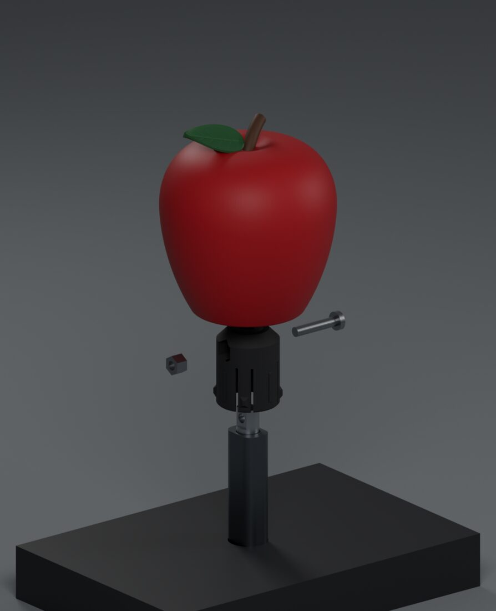
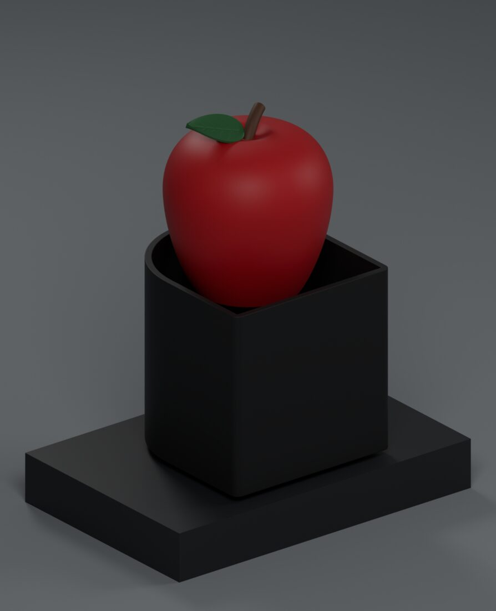
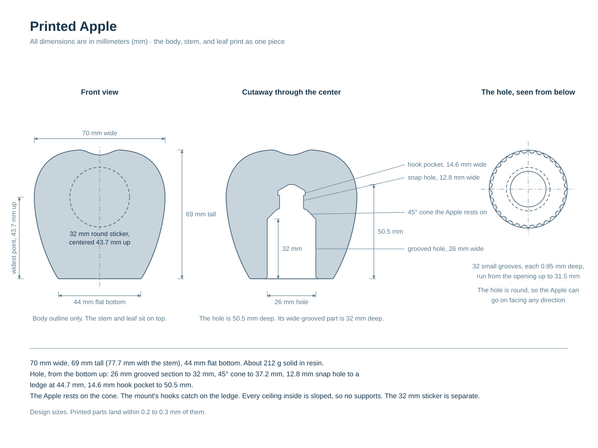
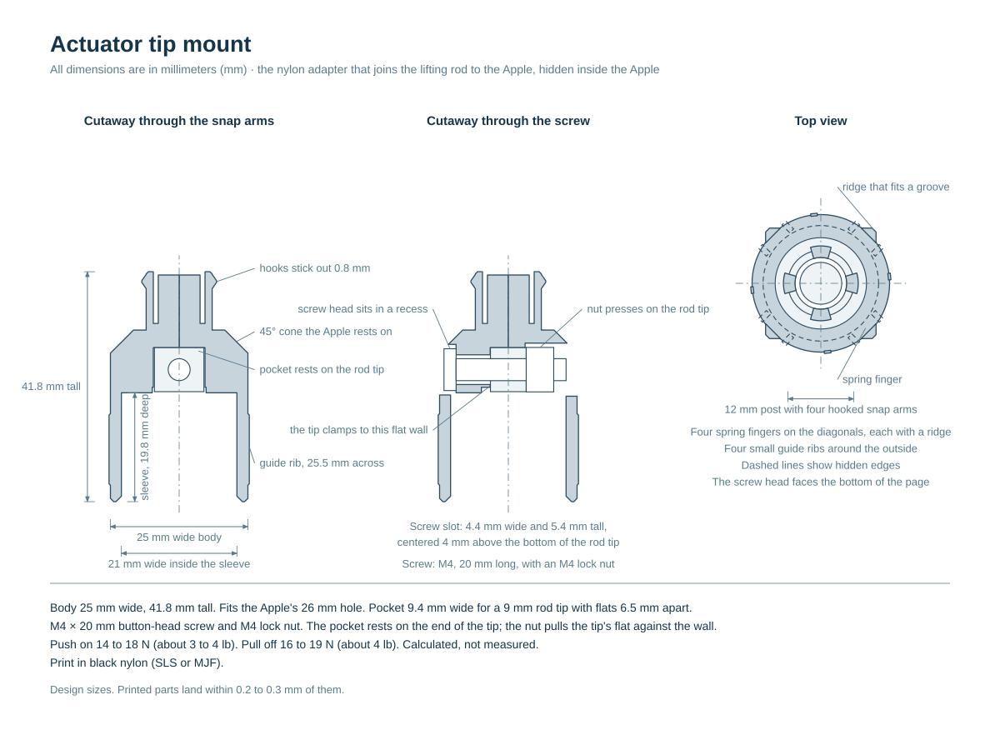
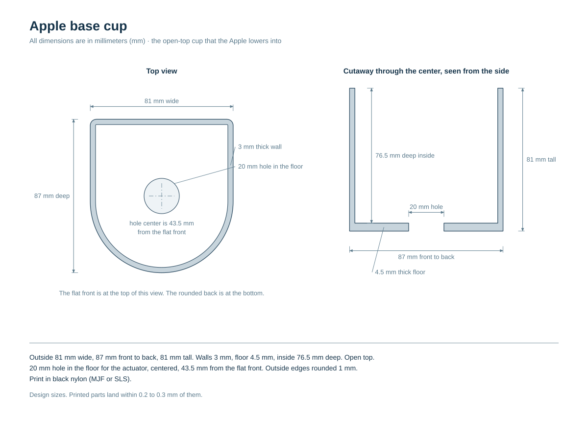

# 3D printing guide

How to print, paint and fit the Apple, the mount that holds it on the actuator,
and the base cup. The [parts list](PARTS.md) has the electronics and the box.
The [wiring diagram](WIRING.md) has the connections. 

The mount clamps to the actuator's rod tip. The Apple snaps onto the mount: push
it on and it clicks into place, centered and facing forward. Pull it off to
remove. 

  
  

## What you need

| Part | Notes |
| --- | --- |
| Apple | `3d-printing/apple.stl`. One piece with the leaf and stem. Solid red resin; paint the leaf and stem by hand. |
| Tip mount | `3d-printing/tip-mount.stl`. Black nylon. Order two or three at about $2 each. |
| Base cup | `3d-printing/base-cup.stl`. Black nylon. |
| M4 × 20 mm button-head screw and M4 nylon-insert lock nut | Clamp the mount to the rod tip. 2.5 mm hex key. |
| 32 mm round sticker | The logo, the same size as the 2018 giveaway's. [`PNG`](3d-printing/mets-roundel-sticker-32mm-600dpi.png) for sticker printers, [`SVG`](3d-printing/mets-roundel-sticker-32mm-cutline.svg) for die-cut services. Conformable vinyl, because the Apple is curved. |
| Paint | Grey primer, dark green, dark brown, satin varnish. See [step 2](#2-paint-the-leaf-and-stem). |
| Velcro strips, optional | Hold the cup on the box.  |

The mount fits the actuator in the parts list: a 9 mm rod tip with flats 6.5 mm
apart, 8 mm long, with a 4 mm cross hole 4 mm from the end.

I started with a giveaway, the [2018 New York Mets Citi Field Delta Home Run Apple Figurine](https://www.ebay.com/sch/i.html?_nkw=2018+New+York+Mets+Citi+Field+Delta+Home+Run+Apple+Figurine). The tip mount fits it too, so with a giveaway you could only
print the mount.

## Files

| File | Part | Size | Volume |
| --- | --- | --- | --- |
| [`apple.stl`](3d-printing/apple.stl) | Apple | 70 × 70 × 77.7 mm | 184.8 cm³ |
| [`tip-mount.stl`](3d-printing/tip-mount.stl) | Tip mount | 25.5 × 25.5 × 41.8 mm | 7.0 cm³ |
| [`base-cup.stl`](3d-printing/base-cup.stl) | Base cup | 81 × 87 × 81 mm | 93.2 cm³ |

## 1. Print the parts

Print them yourself or order them. I have not tried a home filament printer:
the mount should have a springy material such as
nylon, and the Apple is best printed solid in resin.

I ordered from [JLC3DP](https://jlc3dp.com/). Prices are from September 2026,
before shipping.

| Part | Process | Material | Color | Finish | Price |
| --- | --- | --- | --- | --- | --- |
| Apple | SLA (resin) | 9600 Resin | White | Spray painting: Matte, Red, exterior only. Pantone 2347 U, the closest match to the giveaway Apple | $19.48 |
| Tip mount | SLS (nylon) | 3201PA-F Nylon | Grayish black | None | $1.73 |
| Base cup | MJF (nylon) | PA12-HP Nylon | Black | Dyed black | $35.15 |

Notes for the printer:

- Apple: solid, not hollowed. Flat bottom down. No supports in the bottom hole.
  Paint the outside only.
- Tip mount: the slit spring fingers and small hooks are intentional. Clear
  powder gently; do not tumble or polish.
- Cup: open shell, 3 mm walls, no drain holes.

If a file check warns about walls under 0.8 mm, accept it. Those are the
hooks, spring ridges, leaf edges and groove lands, thin by design.

## 2. Paint the leaf and stem

The Apple comes back red. The original's leaf is dark forest green, about
`#2c432c`, and its stem dark brown, about `#614839`, both satin. Brush-on
acrylics that match:

1. Grey primer: Vallejo Surface Primer 70.601. Green straight over red turns
   muddy.
2. Leaf: Vallejo Model Color 70.968 Flat Green. Stem: 70.983 Flat Earth. Two
   thin coats.
3. Satin varnish over both: Vallejo 70.522.

## 3. Add the sticker

- [`mets-roundel-sticker-32mm-600dpi.png`](3d-printing/mets-roundel-sticker-32mm-600dpi.png): 827 × 827 px at 600 dpi, 35 mm
  square. Print at 100 percent with a 32 mm round cut.
- [`mets-roundel-sticker-32mm-cutline.svg`](3d-printing/mets-roundel-sticker-32mm-cutline.svg): the same artwork as vectors, with the
  32 mm cut line as a magenta `CutContour` circle, for die-cut services.

Center the sticker above the flat bottom, at the Apple's widest point,
with the leaf pointing left as you face the logo.

## 4. Put it together

The actuator can stay fully retracted for all of this.

1. Fit the cup over the actuator's tube and center it on the rod.
2. Slide the mount over the tip, screw-head recess to the front. Drop the nut
   into the channel at the back and fit the screw from the front.
3. Push the mount down onto the end of the tip and tighten the screw.
4. Push the Apple straight down over the mount until it clicks.
To turn the Apple, lift it off and set it down again.

## Dimension sheets

