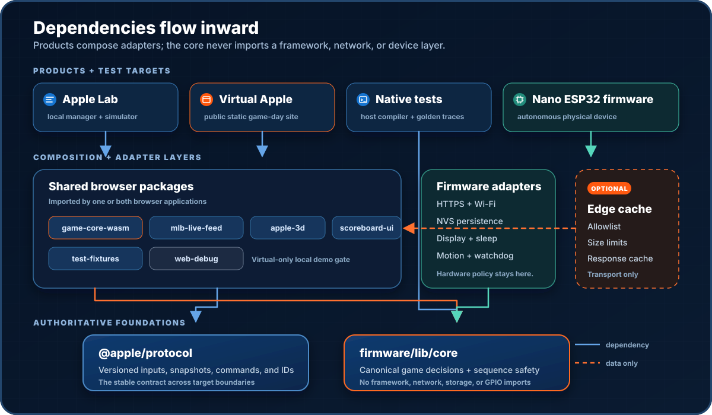

# Architecture

The project has one source of truth for game decisions: a small C++ core that can run in tests, browsers, and eventually on the Nano ESP32.

## Design principles

- **The device is autonomous.** Once configured, the Nano should not need Apple Lab, Virtual Apple, a desktop computer, or a paid server.
- **Rules live in one place.** Home runs, wins, reviews, duplicates, and sequence timing belong in `firmware/lib/core`.
- **Uncertainty means no motion.** Bad, stale, incomplete, or review-pending data must leave the Apple still.
- **Transport is replaceable.** A browser, device adapter, or edge cache may fetch and validate data, but it does not decide what the data means.

## Main pieces

| Piece | Job | Needs a server? |
|---|---|---|
| Nano firmware | Follow the game, update the display, and control the actuator | No |
| Apple Lab | Simulate, replay, diagnose, and eventually manage a local device | No |
| Virtual Apple | Present the live game as a public 3D experience | Static hosting only |
| Feed-cache Worker | Optionally share and cache public feed requests | Optional |

Apple Lab is a builder tool. Virtual Apple is a fan-facing site. Neither browser app currently has a path to physical motion.

## The shared core

The core accepts small, versioned game updates and returns decisions, display state, traces, and motion intent. It does not know about HTTP, JSON, React, Arduino APIs, storage hardware, or GPIO.

The same source is built three ways:

- with a host compiler for fast native tests;
- with Emscripten for browser WebAssembly;
- with the Nano firmware once the hardware adapters are ready.

That arrangement lets the simulator and physical build agree on the rules without maintaining two implementations.

## Game-data flow

1. Find every Mets game for the selected date, including both games of a doubleheader.
2. Load a full snapshot and remember its existing events without celebrating old plays.
3. Request small, bounded updates from the last accepted cursor.
4. Normalize score, inning, outs, status, review state, and completed plays.
5. Let the core reject duplicates, regressions, wrong games, and incomplete evidence.
6. Save an accepted event key before emitting motion intent.
7. Let the current adapter render the display, browser animation, or physical movement.

If a patch cannot be understood safely, the feed adapter requests a fresh full snapshot. Tests use synthetic responses and never call MLB from CI.

## Dependency direction

Dependencies point inward. The core never imports a browser framework, network client, or device driver.

## Management and test boundaries

Apple Lab is divided by purpose:

- **Live game** is read-only.
- **Simulator** uses fake time and recording-only outputs.
- **Historical replay** runs completed games through the same core.
- **Hardware tests** will require an authenticated, short-lived maintenance session issued by the firmware.

Selecting a timeline event or replay bookmark never moves hardware. A future physical test must also confirm that automatic play is suspended, the actuator is idle, and the Apple is home.

Virtual Apple has an even smaller boundary. It reads public game data and turns accepted core decisions into browser animation and sound. It contains no device credentials or management controls.

## Motion boundary

The core can ask for extend, retract, or disable. The ESP32 adapter will own the actual pins, motor direction, end-stop handling, timeouts, and watchdog behavior.

Every extend or retract needs a hard deadline. A timeout must disable motion and latch a fault instead of guessing where the Apple is.

## Hosting

Virtual Apple can be deployed as static files. For a small audience it can read the public feed directly. An optional edge Worker may allowlist, limit, and cache those requests.

The Worker is not a game service and must never become a general-purpose proxy. If it goes away, the physical Apple still works.
