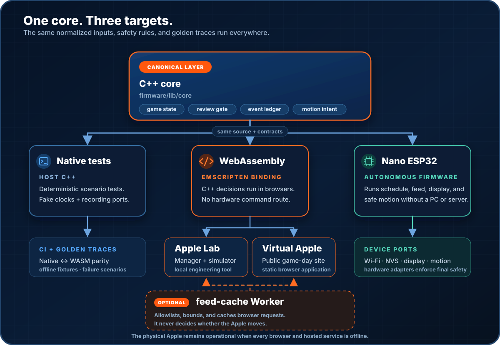

# Architecture

## Components

| Name | What it does |
|---|---|
| Shared C++ core | Makes the game and celebration decisions  |
| Apple Lab | Simulate games, replay past games, diagnose, and configure a physical Apple |
| Virtual Apple | Follow games live with a 3D Apple, scoreboards, sound, and celebrations |
| Physical Apple | Uses a Nano ESP32 to follow games, update its display, and control the motor |

## Game data and decisions

Virtual Apple reaches the MLB Stats API through a narrow same-origin edge relay. The relay removes a fragile cross-origin hop for mobile browsers, briefly shares identical responses at Cloudflare's edge, and falls back to direct MLB access if needed. It has no database and does not make game decisions.

Each MLB update is read once and split into two parts:

- `gameSnapshot` has the score, inning, outs, runners, count, batter, pitcher, status, and line score. Scoreboards and display code read it.
- `coreInput` has only the facts the C++ core needs to decide whether a celebration should start and whether motion should change.

The core returns celebration events and extend, retract, or disable commands. It does not build a scoreboard, choose screen text, play sound, or control hardware directly.

`CELEBRATION` is a temporary screen state, not an MLB game state, so it never goes back into the core. The physical screen receives a smaller `DeviceDisplayState` made from `gameSnapshot`; firmware owns its 2-inch layout.

The two Apples share the underlying score, inning, outs, runners, count, batter and pitcher. Virtual Apple keeps the browser-only extras: long play descriptions, the full line score with hits and errors, team artwork and colors, schedule links, radio, the stadium scene, visual effects and browser accessibility controls. None of those extras can change a motion decision.

## Celebrations while the game continues

MLB polling does not pause when a celebration starts. The core saves each newly confirmed event and queues consecutive home runs in order. The active celebration keeps its own scoreboard snapshot until its complete raise, hold and lower sequence ends; ordinary pitch updates are allowed to pass in the background. The next queued celebration then starts, or the scoreboard catches up to the newest game state when the queue is empty.

Reviews can still hold or overturn an event before motion. Final, completed-early, postponed and cancelled updates wait for active and queued celebrations to finish before the app leaves that game. Doubleheader games keep separate MLB game IDs, so finishing game one does not consume or disarm game two.
