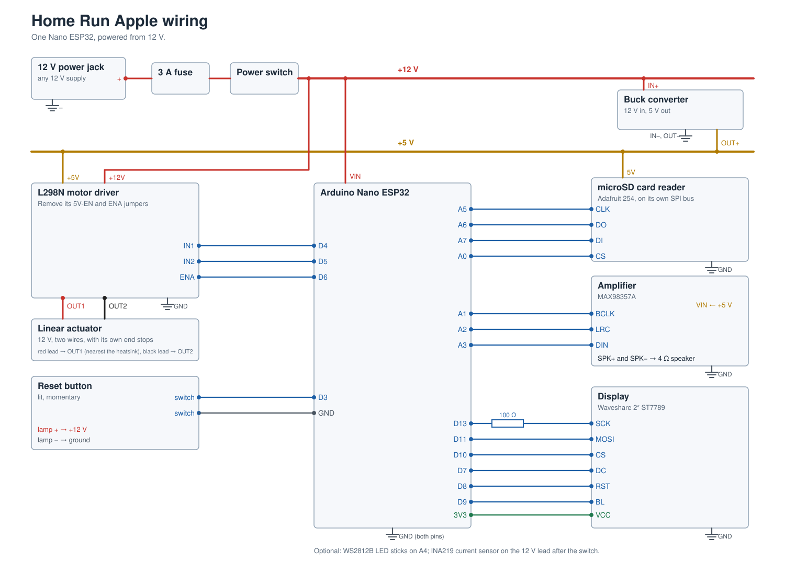

# Wiring

How the physical Home Run Apple is wired. One Arduino Nano ESP32 runs
everything, from a 12 V power jack on the back of the box; any 12 V supply
or battery pack will do.

## Pins

| Nano ESP32 | Goes to |
| --- | --- |
| `VIN` | +12 V |
| `3V3` | Display `VCC` |
| `D13` `D11` `D10` `D7` `D8` `D9` | Display `SCK` (through a 100 Ω resistor), `MOSI`, `CS`, `DC`, `RST`, `BL` |
| `A5` `A6` `A7` `A0` | microSD reader `CLK`, `DO`, `DI`, `CS` |
| `A1` `A2` `A3` | Amplifier `BCLK`, `LRC`, `DIN` |
| `D4` `D5` `D6` | L298N `IN1`, `IN2`, `ENA` |
| `D3` | Reset button switch (the other switch lead goes to `GND`) |
| `A4` | Free; reserved for optional LED sticks |

The firmware defines these in `firmware/include/apple/firmware/board_pins.hpp`
and at the top of `firmware/src/apple_live.cpp`.
